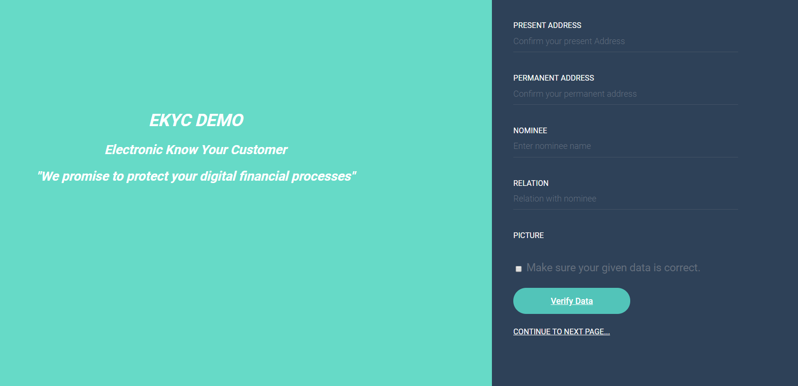

# EKYC DEMO
# React Front end + Flask Back end

## Run app using
* cd react-frontend
* yarn build
* yarn start
* cd flask-backend
* python main.py

## Mongo Command To restore sign-up information
mongorestore --db ekyc --collection users ./flask-backend/dump/ekyc/users.bson

# UI Picture

